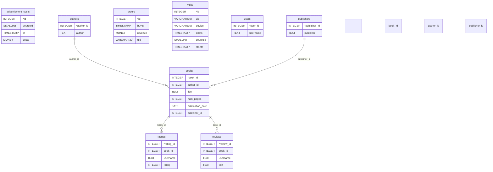

```mermaid
erDiagram
    ratings {
        INTEGER *rating_id
        INTEGER book_id
        TEXT username
        INTEGER rating
    }
    advertisment_costs {
        INTEGER *id
        SMALLINT sourceid
        TIMESTAMP dt
        MONEY costs
    }
    authors {
        INTEGER *author_id
        TEXT author
    }
    orders {
        INTEGER *id
        TIMESTAMP buyts
        MONEY revenue
        VARCHAR(30) uid
    }
    reviews {
        INTEGER *review_id
        INTEGER book_id
        TEXT username
        TEXT text
    }
    visits {
        INTEGER *id
        VARCHAR(30) uid
        VARCHAR(10) device
        TIMESTAMP endts
        SMALLINT sourceid
        TIMESTAMP startts
    }
    books {
        INTEGER *book_id
        INTEGER author_id
        TEXT title
        INTEGER num_pages
        DATE publication_date
        INTEGER publisher_id
    }
    users {
        INTEGER *user_id
        TEXT username
    }
    publishers {
        INTEGER *publisher_id
        TEXT publisher
    }
    books ||--o{ ratings : book_id → book_id
    books ||--o{ reviews : book_id → book_id
    authors ||--o{ books : author_id → author_id
    publishers ||--o{ books : publisher_id → publisher_id
```